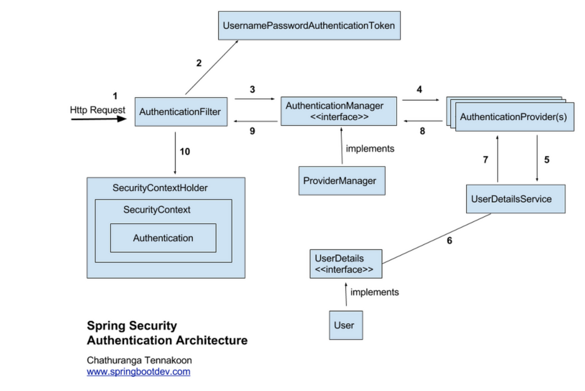

# Spring Security 학습 정리

## Spring Security란?
- Spring 기반 인증(Authentication)과 권한(Authorization)을 처리하는 보안 프레임워크
- Filter 기반 구조로 DispatcherServlet 앞단에서 요청을 가로채어 보안 검사
- 기본 세션/쿠키 방식 지원 + JWT, OAuth2 등 확장 가능

## 기본 동작 원리

1. **사용자가 로그인을 시도**
    - 사용자가 아이디, 비밀번호를 입력하고 로그인 버튼을 누름
    - 이게 `HttpServletRequest`로 서버에 전달
2. **AuthenticationFilter 동작**
    - `UsernamePasswordAuthenticationFilter`가 요청을 가로채서 아이디와 비밀번호를 꺼냄
    - 이걸 `UsernamePasswordAuthenticationToken`이라는 인증용 객체에 담음
    
    → 쉽게 말해, “로그인 시도 티켓”을 만듦
    
3. **AuthenticationManager으로 위임**
    - 필터는 이 티켓(토큰)을 `AuthenticationManager`에게 넘김
    - `AuthenticationManager`의 기본 구현체는 `ProviderManager`
    
    → Manager가 직접 인증하는 게 아니라, 적절한 Provider에게 넘김
    
4. **AuthenticationProvider 호출**
    - `AuthenticationManager`는 여러 `AuthenticationProvider` 중 적절한 걸 선택해서 호출함
    - 보통은 `DaoAuthenticationProvider`가 사용됨
    
    → 해당 아이디가 진짜 DB에 있는지 확인하는 단계
    
5. **UserDetailsService에서 사용자 정보 조회**
    - `AuthenticationProvider`는 `UserDetailsService`에게 아이디를 넘겨서 DB 조회를 요청
    - `UserDetailsServie`는 DB에서 아이디로 사용자를 찾고, 그 정보를 `UserDetails` 객체로 만들어 반환
    
    → 여기에는 아이디, 암호화된 비번, 권한(Role)이 들어있음
    
6. **비밀번호 검증**
    - `AuthenticationProvider`는 DB에서 가져온 `UserDetails`의 암호화된 비밀번호와,
    사용자가 로그인 시 입력한 비밀번호를 비교
    - 이때 `PasswordEncoder`(예: `BCryptPasswordEncoder`)로 비밀번호를 해시해서 비교
    - 맞으면 인증 성공, 틀리면 인증 실패
7. **SecurityContext에 저장 + 핸들러 실행**
    - 인증이 성공하면 새로운 `Authentication` 객체를 만들어서 `SecurityContextHolder` 안에 저장함
    - 즉, 이 요청 스레드에는 “이 사용자가 로그인됨” 이라는 인증 정보가 기록됨
    - 그리고 `AuthenticationSuccessHandler`가 실행돼서 로그인 성공 후 처리(리다이렉트, JSON 응답 등)
    - 실패하면 `AuthenticationFailureHandler`가 실행돼서 에러를 응답

## Filter 구조
- `DelegatingFilterProxy` -> `FilterChainProxy` -> `SecurityFilterChain` -> 다수의 Security Filter 실행
- 요청 URL 패턴별로 적절한 `SecurityFilterChain`이 선택됨

## DelegatingFilterProxy & FilterChainProxy
Servlet 컨테이너와 Spring 컨테이너가 따로 존재하기 때문에, 스프링 빈으로 등록된 필터를 바로 Servlet이 알 수 없음

- **DelegatingFilterProxy**
    - Spring Security가 제공하는 Servlet Filter 구현체
    - Servlet 컨테이너(Filter)와 Spring 컨테이너(Bean Filter) 사이를 연결하는 **다리** 역할
    - 요청/응답을 받아서 스프링 빈으로 등록된 보안 필터(`CorsFilter`, `JwtFilter`, …)로 위임
- **FilterChainProxy**
    - DelegatingFilterProxy 내부에 존재
    - 여러 `SecurityFilterChain`을 관리하며, 요청 URL 패턴에 따라 어떤 SecurityFilterChain을 실행할지 결정
    - SecurityFilterChain 내부의 SecurityFilter들을 순서대로 실행

`DelegatingFilterProxy` → `FilterChainProxy` → `SecurityFilterChain` → 여러 Security Filter 실행
